<div align="center">

# 🚀 Meriç Karpat

### Building AI-Powered SaaS Products That Scale

[](https://www.typescriptlang.org/)
[](https://nextjs.org/)
[](https://openai.com/)

</div>

---

## 💼 Current Focus

I'm building **two production-ready SaaS platforms** from scratch — full-stack, AI-integrated, and built for global users.

<table>
<tr>
<td width="50%" valign="top">

### 🎯 DashPilot
**AI-Powered Amazon Analytics Platform**
```typescript
const dashpilot = {
  problem: "Amazon sellers drowning in data",
  solution: "AI-driven insights + predictive scoring",
  tech: [
    "Next.js 14 (App Router)",
    "PostgreSQL + Prisma",
    "Redis (caching & workers)",
    "OpenAI + Custom ML models",
    "Stripe + Multi-tenant SaaS"
  ],
  status: "Private Beta → 50+ active users"
}
```

**What makes it special:**
- Real-time Keepa data ingestion & analysis
- Token-based AI product scoring
- Background job processing (BullMQ)
- Multi-currency, multi-region support

</td>
<td width="50%" valign="top">

### ⚡ Incident Cortex
**AI-Driven Incident Management**
```typescript
const incidentCortex = {
  problem: "Engineers wasting time searching docs",
  solution: "Semantic search + Slack automation",
  tech: [
    "Express + TypeScript",
    "NeonDB + pgvector",
    "OpenAI Embeddings (RAG)",
    "Slack API (events + commands)",
    "Drizzle ORM"
  ],
  status: "Production-ready backend"
}
```

**What makes it special:**
- Vector similarity search on runbooks
- Slack slash commands for instant answers
- Sub-200ms query latency
- Self-healing incident workflows

</td>
</tr>
</table>

---

## 🛠️ Tech Arsenal

<div align="center">

<p align="center">
  
</p>

### **Core Stack**


### **Backend & Data**


### **AI & ML**


### **Infrastructure**


</div>

---

## 🎯 What I Do Best

```mermaid
%%{init: {'theme':'base', 'themeVariables': { 'primaryColor':'#3b82f6','primaryTextColor':'#fff','primaryBorderColor':'#1e40af','lineColor':'#60a5fa','secondaryColor':'#8b5cf6','tertiaryColor':'#ec4899','background':'#1a1b27','mainBkg':'#3b82f6','secondBkg':'#8b5cf6','tertiaryBkg':'#ec4899'}}}%%
mindmap
  root((Meriç Karpat))
    SaaS Architecture
      Multi-tenant design
      Subscription billing
      API rate limiting
      Background workers
    AI Integration
      RAG pipelines
      Vector embeddings
      LLM orchestration
      Semantic search
    Backend Engineering
      PostgreSQL optimization
      Redis caching strategies
      Job queues (BullMQ)
      Real-time APIs
    Full-Stack Development
      Next.js SSR/SSG
      TypeScript everywhere
      Component libraries
      State management
```


---

## 📊 Real Impact

<div align="center">

| Metric | Value |
|--------|-------|
| 🚀 **SaaS Products Built** | 2 (in production) |
| 🤖 **AI Models Integrated** | OpenAI GPT-4, Embeddings, Custom ML |
| ⚡ **API Response Time** | <200ms (p95) |
| 💾 **Data Processed** | 10M+ product records |
| 👥 **Active Users** | 50+ (and growing) |

</div>

---

## 🏗️ Architecture Philosophy

> **"Build for scale from day one, optimize for developer experience always."**

- **Type-safe everything** — TypeScript end-to-end, Zod validation, Prisma types
- **AI-first thinking** — RAG > fine-tuning, semantic search > keyword matching
- **Observability built-in** — OpenTelemetry, structured logging, error tracking
- **Zero-downtime deploys** — CI/CD with automated testing, gradual rollouts
- **Cost-conscious scaling** — Redis for hot data, PostgreSQL for everything else

---

## 💡 Side Interests

- **Self-hosted LLMs** → Experimenting with Ollama for cost optimization
- **Vector databases** → Building custom pgvector indexes for sub-second search
- **Developer tools** → VSCode extensions, CLI tools, automation scripts
- **SaaS pricing models** → Usage-based vs. subscription vs. hybrid strategies

---

## 📈 GitHub Activity

<p align="center">
  
</p>

<p align="center">
  
  
</p>

---

## 📫 Let's Build Something

<div align="center">

[](mailto:meric.karpat@icloud.com)
[](https://linkedin.com/in/meric-karpat)
[](https://www.google.com/maps/place/Izmir)

### Open to:
🤝 Technical co-founders or advisors for AI/SaaS projects  
💼 Contract work on complex backend systems  
🎙️ Speaking about SaaS architecture & AI integration  
☕ Coffee chats about startup ideas

</div>

---

<div align="center">

**"Ship fast, iterate faster, never stop learning."**

⭐ If you find my work interesting, feel free to star my public repos!

</div>
